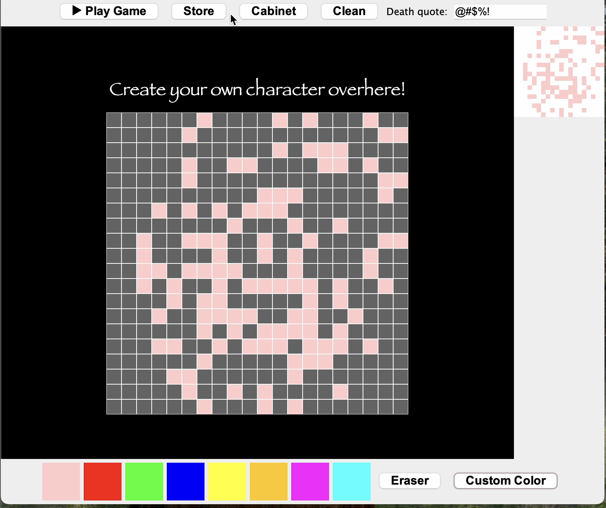

# 🎮 Fancy Q*bert

A Java remake of the classic **Q*bert** arcade game — with a twist. Before you play, you draw your own character on a pixel canvas and it becomes your in-game sprite.

---

## Create Your Character

Draw your own sprite on the pixel canvas before the game starts. Pick colors, use the eraser, or choose a custom color. Your drawing becomes the actual in-game character.You can also customize the death quote for it through the entering box at the right-up corner.



---

## Character Cabinet

Store your creations and load them back anytime. Switch between your private characters and community-uploaded ones. Select any character before hitting Play.


---

## Gameplay

Jump across the isometric pyramid, color every tile to complete the level. Dodge enemies, use flying discs to escape, and survive as long as you can.


---

## Demo Video

<video src="Demo%20video.MOV" controls width="700"></video>

---

## Enemies

| Enemy | Behavior |
|-------|----------|
| **Coily** | Hatches from an egg, then chases you in all directions |
| **Slick** | Hunts your colored tiles and reverts them. Appears from Level 3 |
| **Red Ball** | Bounces randomly downward — deadly on contact |

---

## Controls

| Key | Action |
|-----|--------|
| `Q` / `←` | Jump up-left |
| `W` / `↑` | Jump up-right |
| `A` / `↓` | Jump down-left |
| `S` / `→` | Jump down-right |
| `R` | Restart |
| `Enter` | Next level |

---

## How to Run

1. Download `FancyQbert_demo.zip` from [Releases](../../releases)
2. Unzip the folder
3. Make sure Java is installed (`java -version` in terminal)
4. Open Terminal, `cd` into the unzipped folder
5. Run:
```
java -jar FancyQbert.jar
```

---

## Built With

- Java 17
- Java Swing (UI & game rendering)
- Supabase (community character sharing)
- claude code (debugging, planning what the next step, and explaining me the functions I used in the game)
