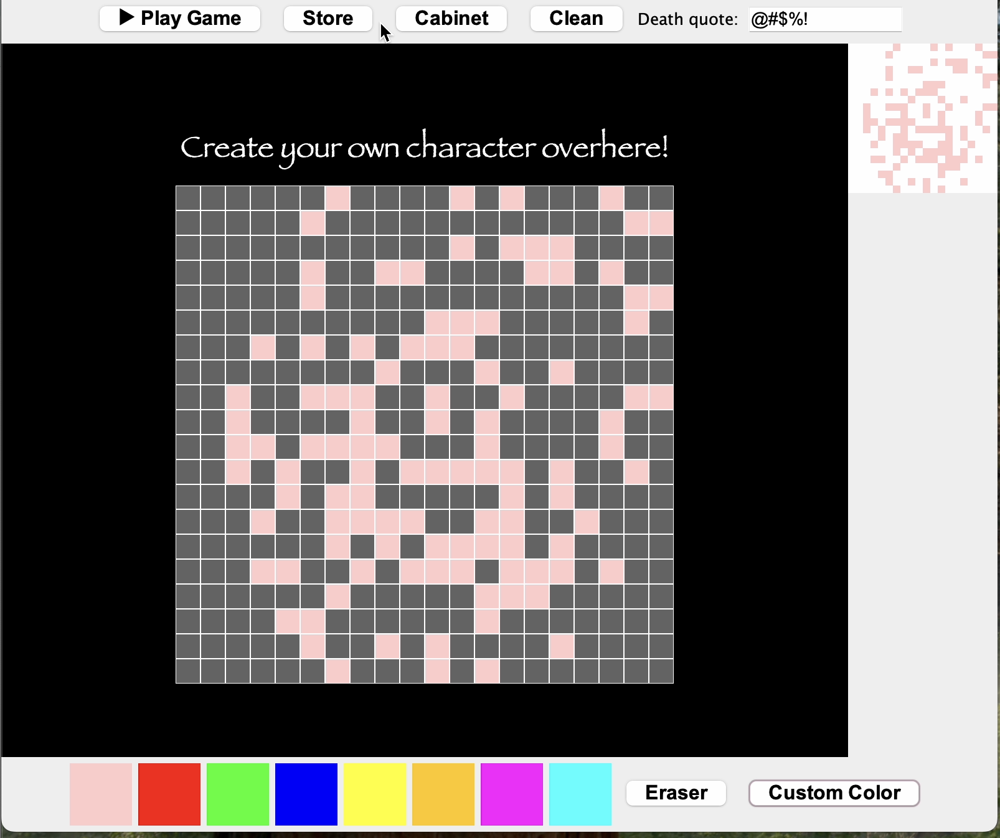

# Fancy Q*bert

Q*bert remake! The main feature is a pixel canvas where you draw your character before playing and that drawing becomes your actual character in the game.

---

## Draw Your Character

There's a pixel canvas where you draw before playing. You can pick from the color palette or use a custom color. There's also a text box in the top right where you type what your character says when it dies.

---

## Character Cabinet

Save your characters here. You can also browse characters other people uploaded. Select one then hit Play.

---

## Gameplay

Same as original Q*bert: jump around the pyramid and color every tile. Don't get hit by enemies.

---

## Demo

---

## Enemies

| Enemy | Behavior |
|-------|----------|
| **Coily** | Starts as an egg, hatches into a snake and chases you |
| **Slick** | Reverts tiles you already colored. Only from level 3 |
| **Red Ball** | Bounces straight down randomly |

---

## Controls

| Key | Action |
|-----|--------|
| `Q` / `←` | Jump up-left |
| `W` / `↑` | Jump up-right |
| `A` / `↓` | Jump down-left |
| `S` / `→` | Jump down-right |
| `R` | Restart |
| `Enter` | Next level |

---

## How to Run

1. Download `FancyQbert_demo.zip` from [Releases](../../releases) and unzip it
2. Check Java is installed: `java -version`
3. Open Terminal, `cd` into the unzipped folder
4. Run: `java -jar FancyQbert.jar`

---

## Built With
- Java + Java Swing
- Supabase (community character cabinet)
- Claude Code (helped me debug and figure out Swing)
